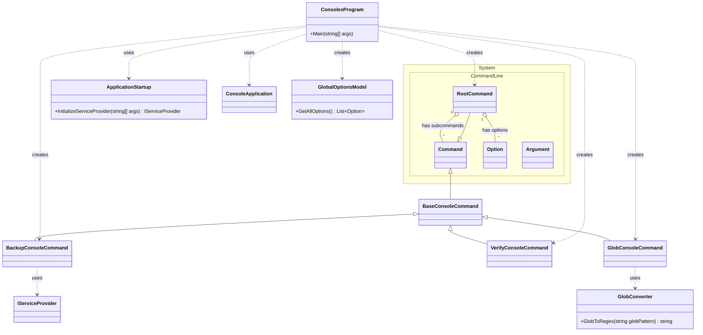

```mermaid
classDiagram
    class ConsolesProgram {
        +Main(string[] args)
    }

    class ApplicationStartup {
        +InitializeServiceProvider(string[] args) IServiceProvider
    }

    class ConsoleApplication {
    }

    namespace System.CommandLine {
        class Command {
        }
        class RootCommand {
        }
        class Option {
        }
        class Argument {
        }
    }

    class BaseConsoleCommand {
    }

    class BackupConsoleCommand {
    }

    class VerifyConsoleCommand {
    }

    class GlobConsoleCommand {
    }

    class GlobalOptionsModel {
        +GetAllOptions() List~Option~
    }

    class GlobConverter {
        +GlobToRegex(string globPattern) string
    }

    Command <|-- RootCommand
    Command <|-- BaseConsoleCommand
    BaseConsoleCommand <|-- BackupConsoleCommand
    BaseConsoleCommand <|-- VerifyConsoleCommand
    BaseConsoleCommand <|-- GlobConsoleCommand

    ConsolesProgram ..> ApplicationStartup : uses
    ConsolesProgram ..> ConsoleApplication : uses
    ConsolesProgram ..> RootCommand : creates
    ConsolesProgram ..> BackupConsoleCommand : creates
    ConsolesProgram ..> VerifyConsoleCommand : creates
    ConsolesProgram ..> GlobConsoleCommand : creates
    ConsolesProgram ..> GlobalOptionsModel : creates

    RootCommand "1" o-- "*" Command : has subcommands
    RootCommand "1" o-- "*" Option : has options

    BackupConsoleCommand ..> IServiceProvider : uses
    GlobConsoleCommand ..> GlobConverter : uses

```
