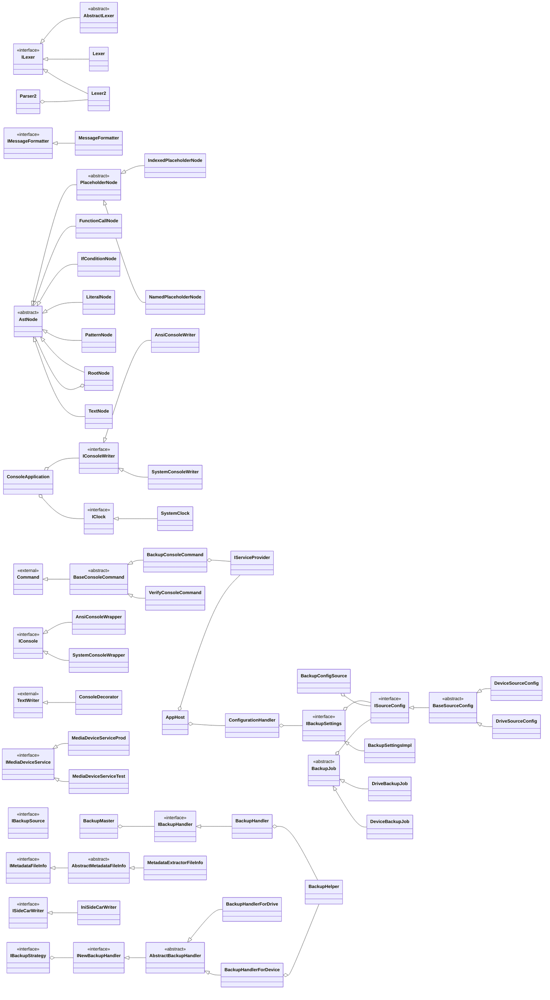

```mermaid
classDiagram
direction LR

class ILexer {
    <<interface>>
}
class AbstractLexer {
    <<abstract>>
}
class Lexer
class Lexer2
class IMessageFormatter {
    <<interface>>
}
class MessageFormatter
class AstNode {
    <<abstract>>
}
class PlaceholderNode {
    <<abstract>>
}
class FunctionCallNode
class IfConditionNode
class IndexedPlaceholderNode
class LiteralNode
class NamedPlaceholderNode
class PatternNode
class RootNode
class TextNode
class Parser2

ILexer <|-- AbstractLexer
ILexer <|-- Lexer
ILexer <|-- Lexer2
IMessageFormatter <|-- MessageFormatter
AstNode <|-- PlaceholderNode
AstNode <|-- FunctionCallNode
AstNode <|-- IfConditionNode
AstNode <|-- LiteralNode
AstNode <|-- PatternNode
AstNode <|-- RootNode
AstNode <|-- TextNode
PlaceholderNode <|-- IndexedPlaceholderNode
PlaceholderNode <|-- NamedPlaceholderNode
Parser2 o-- Lexer2
RootNode o-- AstNode

class IConsoleWriter {
    <<interface>>
}
class AnsiConsoleWriter
class SystemConsoleWriter
class IClock {
    <<interface>>
}
class SystemClock
class ConsoleApplication

IConsoleWriter <|-- AnsiConsoleWriter
IConsoleWriter <|-- SystemConsoleWriter
IClock <|-- SystemClock
ConsoleApplication o-- IClock
ConsoleApplication o-- IConsoleWriter

class Command {
    <<external>>
}
class BaseConsoleCommand {
    <<abstract>>
}
class BackupConsoleCommand
class VerifyConsoleCommand

Command <|-- BaseConsoleCommand
BaseConsoleCommand <|-- BackupConsoleCommand
BaseConsoleCommand <|-- VerifyConsoleCommand
BackupConsoleCommand o-- IServiceProvider

class IConsole {
    <<interface>>
}
class AnsiConsoleWrapper
class SystemConsoleWrapper
class ConsoleDecorator
class TextWriter {
    <<external>>
}

IConsole <|-- AnsiConsoleWrapper
IConsole <|-- SystemConsoleWrapper
TextWriter <|-- ConsoleDecorator

class IMediaDeviceService {
    <<interface>>
}
class MediaDeviceServiceProd
class MediaDeviceServiceTest

IMediaDeviceService <|-- MediaDeviceServiceProd
IMediaDeviceService <|-- MediaDeviceServiceTest

class ISourceConfig {
    <<interface>>
}
class BaseSourceConfig {
    <<abstract>>
}
class DeviceSourceConfig
class DriveSourceConfig
class IBackupSettings {
    <<interface>>
}
class BackupSettingsImpl

ISourceConfig <|-- BaseSourceConfig
BaseSourceConfig <|-- DeviceSourceConfig
BaseSourceConfig <|-- DriveSourceConfig
IBackupSettings <|-- BackupSettingsImpl
IBackupSettings o-- ISourceConfig

class IBackupSource {
    <<interface>>
}
class BackupConfigSource
class BackupJob {
    <<abstract>>
}
class DriveBackupJob
class DeviceBackupJob

BackupConfigSource o-- ISourceConfig
BackupJob <|-- DriveBackupJob
BackupJob <|-- DeviceBackupJob
BackupJob o-- ISourceConfig

class IBackupHandler {
    <<interface>>
}
class BackupHandler
class INewBackupHandler {
    <<interface>>
}
class AbstractBackupHandler {
    <<abstract>>
}
class BackupHandlerForDevice
class BackupHandlerForDrive
class IBackupStrategy {
    <<interface>>
}

IBackupHandler <|-- BackupHandler
INewBackupHandler <|-- AbstractBackupHandler
AbstractBackupHandler <|-- BackupHandlerForDevice
AbstractBackupHandler <|-- BackupHandlerForDrive
IBackupStrategy o-- INewBackupHandler
BackupHandler o-- BackupHelper
BackupHandlerForDevice o-- BackupHelper

class IMetadataFileInfo {
    <<interface>>
}
class AbstractMetadataFileInfo {
    <<abstract>>
}
class MetadataExtractorFileInfo
class ISideCarWriter {
    <<interface>>
}
class IniSideCarWriter

IMetadataFileInfo <|-- AbstractMetadataFileInfo
AbstractMetadataFileInfo <|-- MetadataExtractorFileInfo
ISideCarWriter <|-- IniSideCarWriter

class AppHost
class ConfigurationHandler
class BackupMaster

AppHost o-- ConfigurationHandler
AppHost o-- IServiceProvider
ConfigurationHandler o-- IBackupSettings
BackupMaster o-- IBackupHandler

```